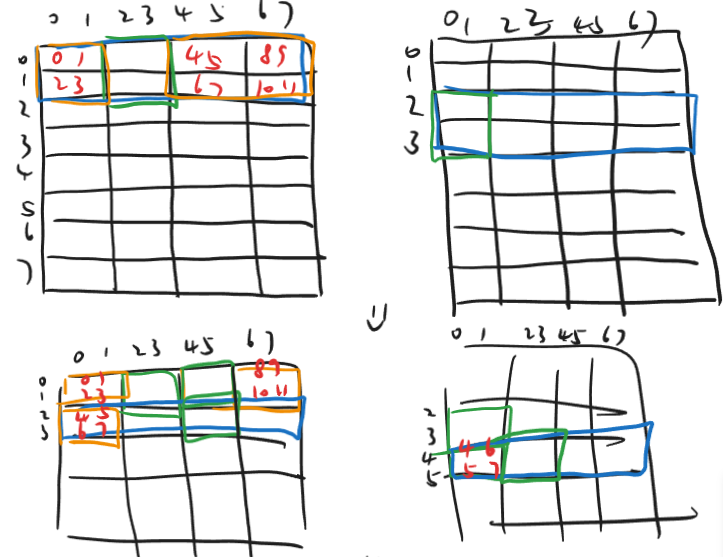
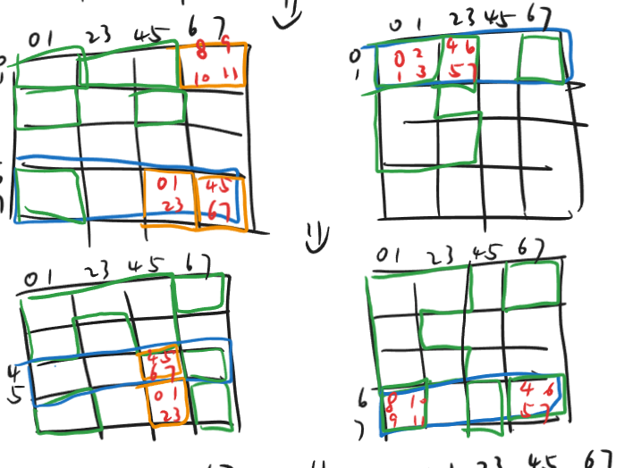
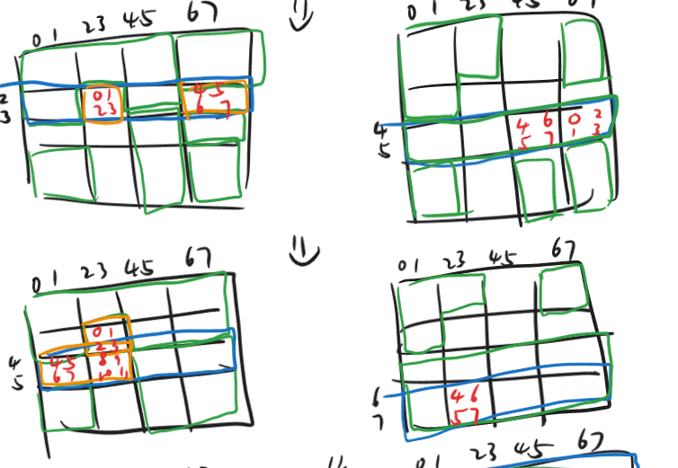
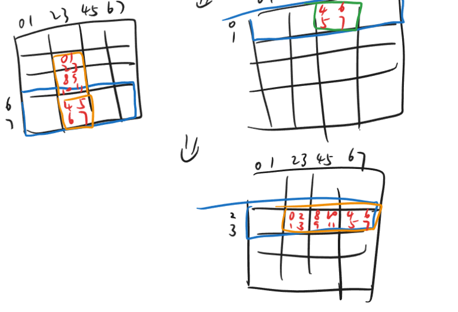

## Part-A

要从头实现一个 cache-sim，我们先把整体架构想好。

第一部分，我们要解析命令行参数，把对应的结果赋值到全局变量里。

第二部分，我们要解析 trace 文件，得到对应的操作。

第三部分，我们发现 `L/S` 对我们而言完全没区别，都是访问某个 addr 一次；`M` 只是访问某个 addr 两次。所以我们只需要实现一个 `access` 函数就可以了。

接下来只需要仔细地实现每一部分，最后就可以得到完整程序了。

## Part-B

我们采用的 cache 参数是 `s=5,E=1,b=5`，所以这是一个很烂的、direct-mapped cache。

一共有 32 个 line，每个 line 里可以存 8 个 int。缓存一共能放 256 个 int。

### 32*32

由于缓存大小有限，我们考虑之后选择把数组切成 $8\times8$ 的小方块逐块处理。这样如果你访问一个小方块的第一列的话，恰好整个小方块都会被放到缓存里，并且 $64\times2=128$ 是不超过缓存大小的。

观察到，我们 A 和 B 数组的地址非常巧，正好同一位置的高位是对齐的。这意味着对角块的访问会彼此 evict。所以我们处理的重点在于对角块。

对于非对角块的部分，我们只需要依次处理就好了，这会导致 $(16-4)\times8\times2=192$ misses。

对于对角块部分，有一个基本的想法是采用类似于递归的过程实现。然而，递归下去之后的结果不再具有“恰好”的性质，换句话说，这里产生了浪费，最终得到的算法是我们无法接受的。

接下来剩下的 4 个对角块是独立的，我们只需要每个对角块造成的 miss 不超过 51 次即可。

我们把 $8\times8$ 进一步细分为 $4\times4$，然后把 A 的上半部分、B 的下半部分放入 cache，此时我们可以直接把 A 右上块放到 B 左下中。这里其实就是我之前说的类似递归的思路，会造成 $8$ 次 miss。

注意到，我们可以声明 12 个临时变量，尝试利用这一点。

我们贪一手，这里直接把 A 左上块的 12 个值存到临时变量里。

然后 AB 缓存区域互换，把 A 左下放到 B 右上。然后顺便把这 12 个值卸下去。这又是 $8$ misses。

这里有一个小细节，文字不太好描述，但总之，通过合理调整我们访问的顺序，我们可以在不引入额外 miss 的前提下，把 16 个值全都搞进去。

所以最后一个 $8\times8$ 块可以在 $16$ misses 内搞定。

按理说，最终结果应该是 $256$，但是实测结果是 $276$。不过这也正常，因为中间会有访问其他地址。

### 64*64

照着上面的，扩大一下规模就可以了。

不对，怎么跟预期差距这么大？

仔细思考，发现在这种情况下限制更加严格。不光有对角块彼此 evict，我们发现每个块内部上四行跟下四行也是彼此 evict 的。

所以需要更好的方法。

经过一些思考，我们能做到非对角块 $18$ 次（比理论最优解多了 $2$），对角块 $30$ 次（比理论最优多了 $14$）。

理论 miss $1248$，实际 $1252$。

下图中，左右两个 $8\times8$ 方阵分别表示同一对角块的 `A,B`（非对角块不演示了）。

绿色表示已完成，蓝色表示目前存在 cache 里的 line，橙色表示用临时变量保存的量。

### 61*67

非对称。最直接的想法就是给它劈成若干个 $8\times8$ 的小方块，不行的部分直接暴力搞。

这样得到的结果是 $2154$，差一点。

考虑分成不同规格的小方块，经过测试发现取 $17\times17$ 时可以通过。

我最开始其实考虑的不是这个做法。最开始我想的是对剩下的部分仔细做一做，看看能不能在做一行的第一个方块时顺便给本行最后一个边角块解决了。后来发现这么写优。

无论怎样，完结撒花！！！